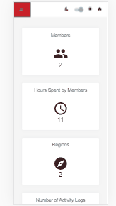

To view the live website click [here](http://gauthamjm007.github.io/ftl-task) 
To view the document regarding this project about components built using styleguidist click [here](https://ftl-task-styleguide.imfast.io/) 
 
Tools and libraries used for building these projects 

**App Features**  1.View the users log  
2.Side Bar and Nav bar for navigation , Use two different themes , remove users , responsive view
 
3.Dashboard view for all the user activites and well responsive according to the user screen
 
4.Mobile view and dark theme
 

Challenges that I faced 
-Calendar view of the users 
-Responsive design 
-Calculating the data for dashboard like duration of user spent 
-using different timezone 
